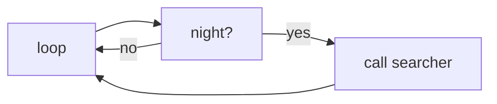
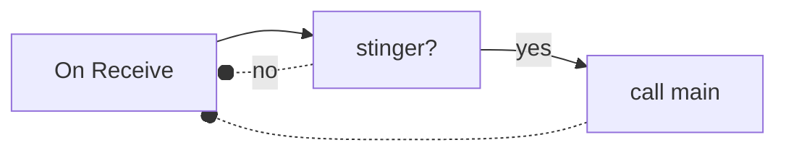
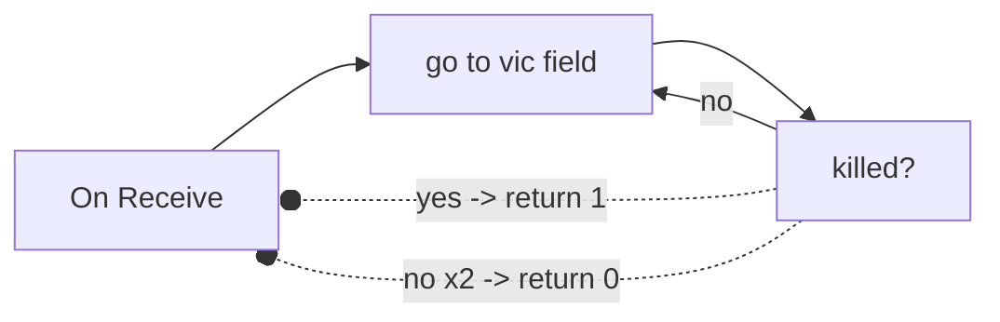

# VicHop
A macro made by Ninju and Ayaanaaa

## Our mission
The goal of the VicHop macro was to communicate with multiple alts about the day/night cycle and have main accounts join the alts once vicious is found in their server.
We use the Socket.ahk library to create a connection between the accounts.

## Logic
Lets define some names:
```diff
-Server:
A private server (n is the amount of servers you have.
The more servers, the more stingers you'll get).
-Call:
A call happens when one account tells another account
to join their server.
-Passive Alts:
For every server except main, you need 1 passive alt.
These passive alts will sit in the server with an unclaimed hive
and constantly check the day cycle.
-Searcher:
Once a passive alt detects night time in the server,
it calls a searcher to check if there is a vicious bee
in the passive alts server.
These searchers need at least 35 bees and access
to the red cannon and need the mountain top parachute.
Its recommended to have 2 searchers.
-Main:
This is the account you will get the stingers.
Once a searcher confirms a vicious bee,
It calls the main account which goes to the field and kills it.
In the searchers call, it also includes the location
of the vicious bee to have the fastest rotation possible.
```
> **Passive Alts:**

> **Searchers:**

> **Main:**



## Requirements
For the VicHop macro to run you need:
> - AutoHotkey v1.1.36+ (dont install v2)
> - As many servers as possible
> - 2 Searchers with at least 35 bees and 25 bee types
> - n passive alts
> - All your alt accounts need to be in the same network as your main account else it WONT WORK

## Additional Information

> **Note:**
> This macro is only available for a selection of people so please be respectful and dont share this macro with anyone

> **Rules:**
> Feel free to use the macro as much as you want but if something doesnt work as intended,
> Dont sue us, rather report it to us so we can try to fix it.
*******
> If you have any suggestions or feel like the macro is missing something important,
> **contact us** on discord with your suggestion

> **Credits:**
> - NicolaiJee -> path
> - Xian, ethanolodj -> logic
> - the guy who created socket.ahk (link later)

### Contact
Contact us via discord:
`ayaanaaa`
`.ninju.`
